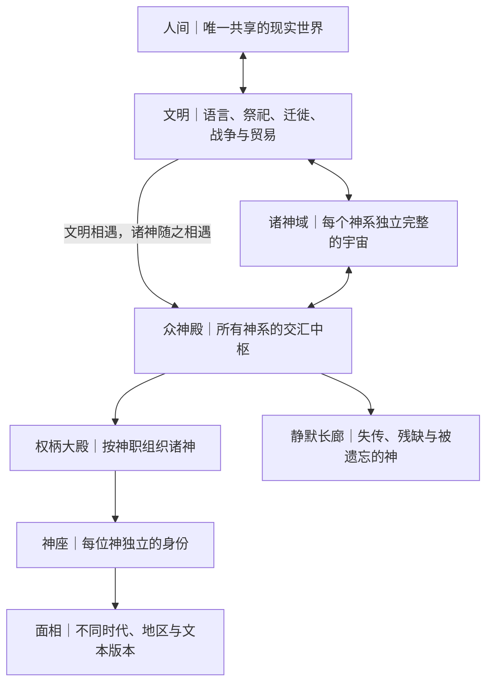

# God-Museum · 众神殿

[](./LICENSE)

[English](./README_EN.md) · **中文**

**在线展厅：** [chendahuang.com/god-museum](https://chendahuang.com/god-museum/)

> **一界，多天，万神，共殿。**

世界只有一个人间，却有许多套天空。

每个文明都曾从自己的方向看见诸神，并用自己的语言为他们命名。奥林匹斯、九界、天庭、昆仑、幽冥、杜阿特和印度诸天各自完整、各自真实，不需要被压进同一张地图，也不需要争夺唯一正确的宇宙。

文明相遇以后，诸神也开始看见彼此。那些名字、权柄、传说与被遗忘的神座，最终共同构成了一座没有唯一主人、也没有最终名单的众神殿。

God-Museum 不宣布所有神都是同一个神。

它只让所有神第一次站进同一座殿里。

---

## 初心

我们想为东西方神话建一座真正的众神殿。

这里不是神话百科的另一种排版，不是战力排行榜，也不是把不同文明的神强行改写成同一套设定。它要做的，是用一种共同的展陈语言，保存彼此并不相同的神话。

统一的是展陈方式，不是神话本身。

每位神都带着自己的名字、故乡、时代、原典、权柄和矛盾进入这里。权柄相近的神可以并肩而立，有历史联系的神可以沿着文明传播的道路重新相遇，但没有谁会因为方便比较而失去自己的身份。

---

## 世界构图



整套设定建立在四句话上：

- **一界：** 人类生活在同一个现实世界。
- **多天：** 每个文明的神话宇宙保持自身完整。
- **万神：** 相似的权柄不等于相同的神。
- **共殿：** 众神可以相遇，但不必互相吞并。

---

## 一界 · 共同的人间

人间是所有神系真正共享的地方。

不同文明面对同一片天空、太阳、海洋、生死、战争和灾难，却由此建立了不同的神话秩序。这些秩序不是同一道谜题的标准答案，而是不同文明与世界相处的方式。

贸易、迁徙、战争、通婚、翻译和宗教传播，让原本彼此陌生的人群发生接触，也让他们的神第一次被另一种语言念出。

> 神不是因为权柄相似才相遇，而是因为信奉、讲述和记住他们的人相遇。

丝绸之路、港口、帝国边疆、翻译中心、朝圣路线和移民社区，都是人间与神话世界共同形成的文明通道。一个神穿过通道之后，可能得到新的名字、形象和解释，但不会因此失去自己的来处。

---

## 多天 · 独立的诸神域

每套神话都拥有自己的天地结构、时间方式和生死秩序。

- 奥林匹斯按照希腊神话运行。
- 九界按照北欧神话运行。
- 天庭、昆仑、幽冥保留中国传统中不同来源与时期的层次。
- 埃及诸神生活在太阳航行、王权与杜阿特构成的秩序里。
- 印度诸天保留自身的宇宙周期、神祇体系与化身传统。

诸神域不是平行国家，也不是摆在同一张地理地图上的大陆。它们是依附于人间、由不同文明抵达和讲述的神话层。

因此，宙斯、奥丁、玉皇大帝和因陀罗可以分别在自己的体系中拥有至高权威。众神殿不会再设立一个凌驾于所有神系之上的“唯一神王”，也不会用统一战力衡量来自不同传统的神。

---

## 共殿 · 众神殿

众神殿不属于任何文明，也没有最高统治者。

它既是诸神的交汇地，也是议庭、档案馆、圣所和记忆之城。它不创造神，不授予神性，不决定谁更真实；它只为曾经被一个文明认真敬畏、讲述和记住的神保留位置。

众神殿的起源只有一句话：

> 人类第一次承认异族的神也是神时，众神殿出现了第一扇门。

每当一个文明真正认识另一个文明的神，殿中便可能出现新的道路、房间或神座。道路是否打开，不取决于两位神看起来多么相似，而取决于人类历史中是否发生过理解、翻译、传播、冲突或融合。

众神殿中的座次不代表力量高低。一个神在自己的诸神域中仍然服从本土神话的秩序；来到众神殿以后，他获得的是被其他神系看见的资格，而不是对其他文明的统治权。

---

## 万神 · 一位神如何存在

众神殿以五个维度保存一位神：

| 维度 | 含义 |
| --- | --- |
| **神座** | 神在众神殿中的独立身份。每位神只有一个神座。 |
| **权柄** | 神所掌管、影响或象征的领域。一位神可以拥有多个权柄。 |
| **面相** | 同一位神在不同时代、地区、祭祀传统和文本中的形象。 |
| **关系** | 神与其他神、英雄、文明和神话事件之间有明确类型的联系。 |
| **原典** | 产生并记录这位神的文本、铭文、仪式、图像与历史证据。 |

### 神座

神座保证每位神不会在跨文明比较中被抹去身份。

索尔、宙斯、雷公和因陀罗都与雷霆有关，但他们拥有不同的神座。共同权柄只能让他们进入同一座大殿，不能证明他们是同一个存在。

### 权柄

权柄不是神的分类标签，而是他与世界发生关系的方式。

宙斯不只涉及雷霆，还涉及天空、王权、秩序、誓言与待客法。拥有相同权柄的神可能承担完全不同的文化角色，因此比较必须同时展示相似与差异。

### 面相

同一个神在不同文本、地区和时代中可能拥有互相冲突的形象。

众神殿不选出唯一标准版本。早期神话、地方祭祀、宗教体系、王朝改造和后世文学都可以成为神座的不同面相，并明确标注各自的来源与年代。

矛盾不是错误，而是神在历史中留下的层次。

### 关系

所有跨神系关系都必须说明性质：

- 血缘、婚姻、敌对、盟约与从属；
- 同神异名；
- 同神异相；
- 传播过程中形成的变体；
- 有历史依据的神格认同或融合；
- 权柄相近但互相独立；
- God-Museum 原创建立的设定关系。

“相似”“传播”“融合”和“原创”不能写成同一件事。索尔与宙斯是权柄相近的独立神座；希腊宙斯与罗马朱庇特之间则存在复杂的历史认同。两种关系必须分开记录。

### 原典

每个神座都要通向产生他的文明。

名字、职能、亲缘、故事和形象应尽可能回到具体文本、铭文、遗址、器物或祭祀传统。后世文学、现代流行文化和 God-Museum 的原创解释必须与早期材料分层呈现。

原典决定我们能够对一位神确认到哪里，原创设定则从边界之外开始。

---

## 十二座权柄大殿

众神按照权柄进入大殿，而不是按照国家被隔开。

1. **创世与原初之殿**：混沌、宇宙诞生、造物、始祖与原初存在。
2. **天空、王权与秩序之殿**：天穹、神王、法律、誓言与统治正当性。
3. **太阳、月亮与星辰之殿**：天体、光明、历法、昼夜与宇宙运行。
4. **雷霆、风、雨与火之殿**：天气、风暴、雷电、火焰与天罚。
5. **山岳、海洋与河流之殿**：山川、海域、泉源、航行与自然疆界。
6. **土地、丰收与生命之殿**：农耕、季节、生长、医疗与生命延续。
7. **爱欲、婚姻与生育之殿**：欲望、结合、家庭、分娩与血脉。
8. **战争、胜利与守护之殿**：征战、勇武、城市保护、复仇与胜利。
9. **智慧、技艺与文明之殿**：知识、文字、工艺、音乐、医术与发明。
10. **命运、预言与时间之殿**：宿命、占卜、记忆、时间与不可违逆的秩序。
11. **道路、信使、交易与诡计之殿**：旅行、边界、语言、商业、偷盗与变化。
12. **死亡、审判与冥界之殿**：死亡、葬仪、灵魂、审判、祖先与来世。

一位神可以通向多座大殿，但不会因此产生多个重复身份。大殿是看见神的不同入口，神座才是他的完整存在。

十二座大殿也不是永恒不变的终极分类。遇到无法归入现有结构的神，众神殿应当为神改变建筑，而不是为了建筑删改神。

---

## 众神殿周围

诸神是中心，但一套神话从来不只由神组成。众神殿周围还有六个彼此连接的区域。

### 英雄长廊

保存半神、文化英雄、圣王、勇士、先知、弑神者以及曾经进入神域的凡人。他们是人间与诸神域之间最常见的行动者。

### 圣物宝库

保存神器、武器、王冠、契约、乐器、容器和禁忌之物。圣物必须连接到它的持有者、制造者、相关事件与原典，而不是成为脱离神话的装备列表。

### 异兽庭院

保存神兽、怪物、恶魔、精灵和无法稳定归类的非人存在。它们可能是神的敌人、后裔、坐骑、化身，也可能来自比诸神更古老的秩序。

### 神话剧场

保存创世、神战、英雄远征、洪水、末日、王朝更替等重大叙事。同一事件在不同文本中的版本并排存在，跨文明的相似事件只建立对照，不自动判定为同一场历史。

### 文明通道

记录诸神如何随商路、帝国、迁徙、翻译和宗教传播进入新的文化。真正发生过的借用、改名、融合和抵抗，都在这里形成诸神域之间的道路。

### 静默长廊

为已经失传、只剩残片、仅存名字或彻底被遗忘的神保留位置。

被遗忘的神不会立刻消失。他们只是失去通往人间的道路，神座逐渐沉入黑暗。当名字重新被发现、翻译或讲述，沉睡的神座可能再次亮起。

众神殿不仅保存最著名的神，也为被征服和失语的文明留下空位。

---

## 神如何相遇

神系之间的相遇必须经过可以说明的道路。

### 文明接触

贸易、迁徙、战争、征服和通婚让神的名字进入另一种语言。这是最常见、也最有历史基础的道路。

### 翻译与认同

一个文明可能用自己的神去理解另一个文明的神。这样的认同会在众神殿中建立联系，但不会自动抹去两个神座原本的差异。

### 宗教传播

神祇、菩萨、护法、判官和地方神在传播过程中可能改变性别、形象、职能或亲缘。每次变化都会形成新的面相，并保留传播路径。

### 原创交汇

God-Museum 可以让历史上从未相遇的神在众神殿中对话、结盟或冲突，但这种关系必须明确属于设定层。原创的自由建立在来源清楚之上。

---

## 神力、遗忘与复苏

众神殿不采用“信徒越多，战力越高”的简单规则。

- 神的存在不由信徒数量决定；
- 神进入人间，需要名字、象征、故事、仪式或地点作为落点；
- 被遗忘不会让神彻底死亡，却会使他失去影响人间的道路；
- 被重新发现、翻译和讲述，可以让沉睡的神座重新显现；
- 神在本土诸神域中的权威，不能直接换算成众神殿中的战斗力。

这里保留一个永远不回答的根本问题：

> 是人类为世界赋予名字，于是创造了神；还是神先把自己的名字放进了人类的语言？

God-Museum 不替任何文明给出最终答案。

---

## 时间、版本与矛盾

人间时间大体向前流动，神话时间却可以循环、重演、断裂，也可以在不同文本中拥有多个起点和结局。

众神殿位于这些时间之外。它能够同时保存一位神的早期形象、地方形象、宗教形象和文学形象，却不会假装它们从一开始就完全一致。

历史上的融合会留下新的面相和关系；历史上的断裂也会留下空白。无法解决的矛盾不被偷偷删掉，而被记录为神座的一部分。

---

## 三层文本

God-Museum 的所有内容都必须区分三个层次：

### 原典层

历史材料实际记录了什么。包括古籍、史诗、铭文、考古材料、仪式、地方传统与可靠研究。

### 整理层

God-Museum 如何整理神谱、权柄、版本、关系和跨文明对照。整理可以提出判断，但必须说明证据和不确定性。

### 设定层

God-Museum 如何让诸神进入众神殿，如何描写他们的相遇，以及如何在原有神话之间创造新的故事。

原典层不为原创背书，原创也不冒充古代传统。三层分开以后，众神殿既能尊重神话，也能拥有属于自己的世界。

---

## 众神殿的边界

God-Museum 不负责证明神真实存在，不用现代科学解释古代神话，也不把相似故事宣布为同一场历史。

它不建立跨文明的唯一正统，不排列神系高低，不用流行文化形象覆盖原典，也不会为了让设定整齐而消灭矛盾。

它要做的是：

- 保存每位神的来处；
- 展示不同文明如何理解相似的世界；
- 记录诸神如何随人类历史相遇、变化与被遗忘；
- 在来源清楚的基础上，创造一座真正能够容纳万神的共同殿堂。

众神殿没有最终名单。

只要人类仍在发现失落的名字、重新阅读古老的故事，并愿意承认另一种文明的神也是神，这座殿就会继续生长。

---

## 进入众神殿

这套设定已经开始作为真实内容仓库运行：

- [众神殿总目录](./CATALOG.md)
- [设定宪章与编目协议](./00_foundation/README.md)
- [十二座权柄大殿](./01_halls/README.md)
- [神明档案](./02_deities/README.md)
- [文明、诸神域与文明通道](./03_civilizations/README.md)
- [英雄长廊](./04_heroes/README.md)
- [圣物宝库](./05_relics/README.md)
- [异兽庭院](./06_beasts/README.md)
- [神域与地点](./07_places/README.md)
- [神话剧场](./08_myths/README.md)
- [书目与原典节点](./99_sources/bibliography.md)

当前已经建立十八个正式神座。中国、希腊、北欧与吠陀传统的八座神座之外，古埃及馆一次接入拉、奥西里斯、伊西斯、荷鲁斯、塞特、阿努比斯、托特、哈索尔、玛阿特与阿蒙。另有特内姆／特内梅特、肯提阿门提乌两个 fragmentary 名字留在静默长廊，不用现代想象补成人格。

神座不再是孤立简介。大禹、赫拉克勒斯与法老王权角色连接人神边界；七件圣物分别保存武器、修补材料、神眼、稳定和生命文字；弗栗多、黑龙、阿佩普与阿米特展示四种不同的非人分类边界；瓦尔哈拉、索尔领域、杜阿特、赫利奥波利斯、阿拜多斯与众神殿本体把神话空间和历史地点分开；九场有来源的神话事件连接神座、行动者、圣物、异兽、地点与权柄大殿。

古埃及馆尤其保存三条不能被压平的轴线：金字塔文—棺材文—亡灵书—冥界诸书的文本连续与变体，地方城市和神庙造成的宗教地图变化，以及荷鲁斯面相裂分、阿蒙—拉等神格融合。第一座完成互联的大殿仍是[雷霆、风、雨与火之殿](./01_halls/04_thunder-wind-rain-and-fire.md)，但太阳殿、爱欲殿与死亡殿也已从空殿转为可沿来源进入的完整展区。

这些条目通过持有、敌对、参与事件、地点归属与母题对照互相链接。读者可以从一位神进入其圣物，再进入相关神话与对手，最后回到文明传统和跨文明大殿；GitHub Markdown 与网站全文搜索读取的是同一张馆藏网络。

---

## 网站与仓库

GitHub Markdown 是 God-Museum 唯一的内容源。网站不会维护第二份正文，也没有 CMS：构建时由 Astro 直接读取这些文档，生成首页、完整目录、神明与大殿页面以及本地全文搜索。

```bash
pnpm install
pnpm dev               # http://localhost:43118/god-museum/
pnpm build             # 编目校验 + Astro 类型检查 + 静态构建 + 站内链接校验
pnpm deploy            # 部署独立 Cloudflare Pages 项目
pnpm deploy:router     # 部署 chendahuang.com/god-museum/* 路径代理
```

部署结构：

- 独立 Pages 项目：`god-museum.pages.dev`
- 公开主地址：`https://chendahuang.com/god-museum/`
- Worker 只接管 `/god-museum` 与 `/god-museum/*`，不会接管博客的其他路径。
- 生成产物位于 `dist/god-museum`，部署 `dist` 以保留公开路径前缀。

---

## 授权

God-Museum 的设定、文本、分类结构、宇宙观、神谱整理和相关原创表达目前不公开授权。你可以阅读、fork、提 issue 或 PR 参与讨论；未经书面许可，不得复制、改编、再发布、商用，或用于游戏、小说、漫画、影视、展览、数据集、模型训练及其他衍生项目。

完整条款见 [LICENSE](./LICENSE)。合作或商业使用请先联系项目所有者。
