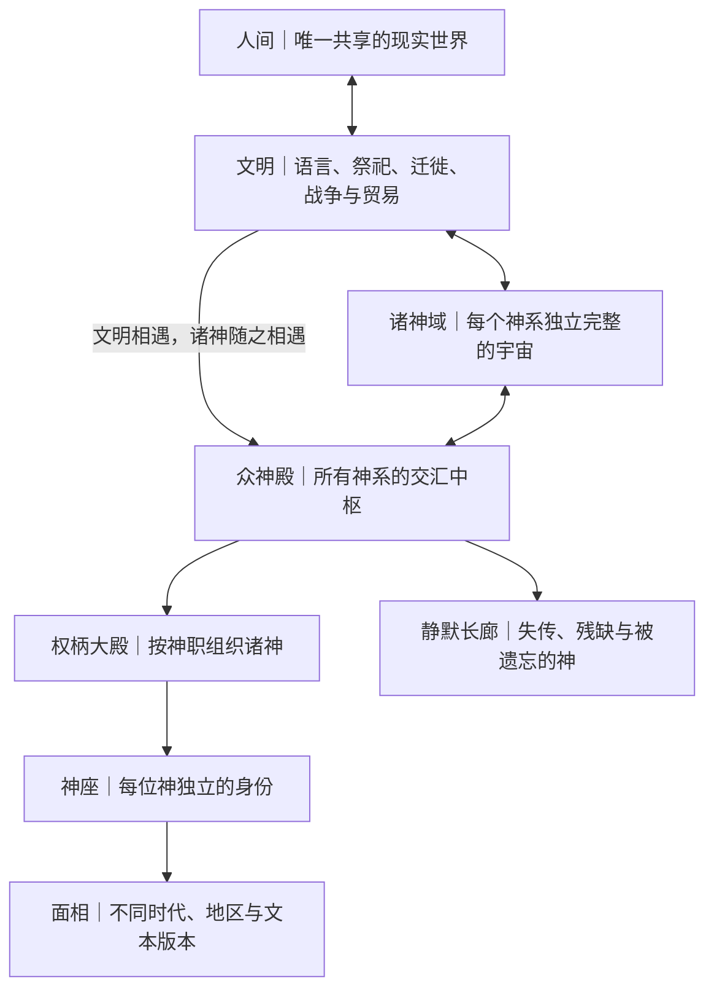

# God-Museum · 众神殿

[](./LICENSE)

[English](./README_EN.md) · **中文**

**在线展厅：** [chendahuang.com/god-museum](https://chendahuang.com/god-museum/)

> **一界，多天，万神，共殿。**

你正在打开一座不属于任何文明的建筑。

世界上只有一个人间，却有许多套天空。希腊人抬头看见奥林匹斯，北方人看见九界，商周的祭司写下“帝”，道教的经师描出三清，埃及人在杜阿特中航行，两河的人为神建起一座座城。每套天空都完整地运转着，互不隶属，也不需要被压进同一张地图。

文明相遇之后，这些天空开始互相望见。名字、权柄、传说、被遗忘的神座，慢慢汇成一座没有主人、也没有最终名单的众神殿。

你要做的只有一件事：走进去。

---

## 这座殿是什么

我们想给东西方神话建一座真正的众神殿。

这里不是神话百科的另一种排版，不是战力排行榜，也不是把不同文明的神强行改写成同一套设定。这里只用一套共同的展陈语言，保存彼此并不相同的神话。

统一的是展陈方式，不是神话本身。

每位神带着自己的名字、故乡、时代、原典、权柄和矛盾进来。权柄相近的神可以并肩而立；有历史联系的神可以沿着文明传播的路再次相遇。但没有哪位神会为了方便比较，丢掉自己的身份。

---

## 世界构图


```mermaid
flowchart TB
    E["人间｜唯一共享的现实世界"]
    C["文明｜语言、祭祀、迁徙、战争与贸易"]
    R["诸神域｜每个神系独立完整的宇宙"]
    P["众神殿｜所有神系的交汇中枢"]
    H["权柄大殿｜按神职组织诸神"]
    G["神座｜每位神独立的身份"]
    F["面相｜不同时代、地区与文本版本"]
    S["静默长廊｜失传、残缺与被遗忘的神"]

    E <--> C
    C <--> R
    C -->|"文明相遇，诸神随之相遇"| P
    R <--> P
    P --> H
    H --> G
    G --> F
    P --> S
```

整座殿建立在四块基石上：

- **一界：** 人类生活在同一个现实世界。
- **多天：** 每个文明的神话宇宙保持自身完整。
- **万神：** 相似的权柄不等于相同的神。
- **共殿：** 众神可以相遇，但不必互相吞并。

---

## 一界 · 共同的人间

所有神系真正共享的，只有这一个世界。

同一片天空、同一轮太阳、同一种生死，摆在所有文明面前。每个文明都从同样的现实出发，搭起自己的一套神话秩序。秩序与秩序之间没有标准答案，只有各自与这个世界相处的方式。

贸易、迁徙、战争、通婚、翻译和宗教传播，让原本陌生的人群彼此接触，也让他们的神第一次被另一种语言念出。

> 神不是因为权柄相似才相遇，而是因为信奉、讲述和记住他们的人相遇。

丝绸之路、港口、帝国边疆、翻译中心、朝圣路线和移民社区，是人间和神话世界共同踩出来的文明通道。一位神穿过通道，可能得到新的名字、形象和解释，但不会因此丢掉自己的来处。

---

## 多天 · 独立的诸神域

每套神话都有自己的天地结构、时间方式和生死秩序。

- 奥林匹斯按希腊神话运转。
- 九界按北欧神话运转。
- 天庭、昆仑、幽冥保留中国传统不同来源和时期的层次。
- 埃及的神活在太阳航行、王权与杜阿特构成的秩序里。
- 印度的天保留自己的宇宙周期、神祇体系与化身传统。

诸神域不是平行国家，也不是摆在同一张地图上的大陆。它们是附着在人间之上、由不同文明抵达和讲述的神话层。

所以宙斯、奥丁、玉皇大帝、因陀罗可以在各自的体系里拥有至高权威。众神殿不设凌驾于所有神系之上的唯一神王，也不用统一战力衡量来自不同传统的神。

---

## 共殿 · 众神殿

众神殿不属于任何文明，也没有最高统治者。

它是交汇地，是议庭，是档案馆，是圣所，也是记忆之城。它不造神，不授予神性，不裁决谁更真实；它只给每一位曾被一个文明认真敬畏、讲述和记住的神留一个位置。

这座殿的来历只有一句话：

> 人类第一次承认异族的神也是神时，众神殿出现了第一扇门。

每当一个文明真正认识另一个文明的神，殿里就可能多出一条路、一间房或一座神座。路开不开，不看两位神看起来多像，而看人类历史上有没有真正发生过理解、翻译、传播、冲突或融合。

殿里的座次不代表强弱。一位神在自己的诸神域里仍服从本土秩序；进入众神殿，他获得的是被其他神系看见的资格，而不是统治其他文明的权利。

---

## 万神 · 一位神如何存在

众神殿用五个维度保存一位神：

| 维度 | 含义 |
| --- | --- |
| **神座** | 神在众神殿中的独立身份。每位神只有一个神座。 |
| **权柄** | 神所掌管、影响或象征的领域。一位神可以拥有多个权柄。 |
| **面相** | 同一位神在不同时代、地区、祭祀传统和文本中的形象。 |
| **关系** | 神与其他神、英雄、文明和神话事件之间有明确类型的联系。 |
| **原典** | 产生并记录这位神的文本、铭文、仪式、图像与历史证据。 |

### 神座

神座保证每位神不会在跨文明比较里被抹去身份。

雷公、宙斯、索尔、因陀罗都和雷霆有关，但各有各的神座。共同权柄只让他们走进同一座大殿，不证明他们是同一个存在。

### 权柄

权柄不是分类标签，而是神与世界发生关系的方式。

宙斯不只掌管雷霆，还掌管天空、王权、秩序、誓言与待客法。两个神权柄相同，文化角色可能完全不同——所以比较时，相似和差异必须一起摆出来。

### 面相

同一个神在不同文本、地区、时代里，可能有一副互相冲突的样子。

众神殿不替你选“哪个版本才是真的”。早期神话、地方祭祀、宗教体系、王朝改造、后世文学，都可以作为这位神的一面，各自标注来源和年代。

矛盾不是错误，它是神在历史里留下的地层。

### 关系

所有跨神系关系都必须写清性质：

- 血缘、婚姻、敌对、盟约与从属；
- 同神异名；
- 同神异相；
- 传播过程中形成的变体；
- 有历史依据的神格认同或融合；
- 权柄相近但互相独立；
- God-Museum 原创建立的设定关系。

“相似”“传播”“融合”“原创”不能写成同一件事。索尔与宙斯是权柄相近的独立神座；希腊宙斯与罗马朱庇特之间则有复杂的历史认同。两种关系必须分开记录。

### 原典

每位神都通向生养他的文明。

名字、职能、亲缘、故事、形象，尽量回到具体的文本、铭文、遗址、器物或祭祀传统。后世文学、现代流行文化和 God-Museum 的原创解释，必须与早期材料分层摆放。

原典决定你能确认到哪里；原创设定从确认的边界之外开始。

---

## 十二座权柄大殿

众神按权柄进殿，不按国籍隔开。

1. **创世与原初之殿**：混沌、宇宙诞生、造物、始祖与原初存在。
2. **天空、王权与秩序之殿**：天穹、神王、法律、誓言与统治正当性。
3. **太阳、月亮与星辰之殿**：天体、光明、历法、昼夜与宇宙运行。
4. **雷霆、风、雨与火之殿**：天气、风暴、雷电、火焰与天罚。
5. **山岳、海洋与河流之殿**：山川、海域、泉源、航行与自然疆界。
6. **土地、丰收与生命之殿**：农耕、季节、生长、医疗与生命延续。
7. **爱欲、婚姻与生育之殿**：欲望、结合、家庭、分娩与血脉。
8. **战争、胜利与守护之殿**：征战、勇武、城市保护、复仇与胜利。
9. **智慧、技艺与文明之殿**：知识、文字、工艺、音乐、医术与发明。
10. **命运、预言与时间之殿**：宿命、占卜、记忆、时间与不可违逆的秩序。
11. **道路、信使、交易与诡计之殿**：旅行、边界、语言、商业、偷盗与变化。
12. **死亡、审判与冥界之殿**：死亡、葬仪、灵魂、审判、祖先与来世。

一位神可以同时通向多座大殿，但不会因此分裂成多个身份。大殿是看见神的不同入口，神座才是神的完整存在。

十二座大殿不是永恒的终极分类。遇到装不下的神，众神殿会为神改建筑，而不是为了建筑删改神。

---

## 众神殿周围

神是这座殿的中心，但一套神话从来不只有神。离开主殿向外走，你会经过六个彼此相连的区域。

### 英雄长廊

半神、文化英雄、圣王、勇士、先知、弑神者，还有走进过神域的凡人。他们是人间与诸神域之间最常见的行动者。

### 圣物宝库

神器、武器、王冠、契约、乐器、容器、禁忌之物。圣物必须连着它的持有者、制造者、相关事件和原典，而不是一张脱离神话的装备清单。

### 异兽庭院

神兽、怪物、恶魔、精灵，还有无法归类的非人存在。他们可能是神的敌人、后裔、坐骑、化身，也可能来自比诸神更古老的秩序。

### 神话剧场

创世、神战、英雄远征、洪水、末日、王朝更替。同一事件在不同文本里的版本并排陈列；跨文明的相似事件只建立对照，不自动判成同一场历史。

### 文明通道

诸神如何随商路、帝国、迁徙、翻译和宗教传播进入新的文化。真正发生过的借用、改名、融合和抵抗，都在这里连成诸神域之间的道路。

### 静默长廊

为已经失传、只剩残片、只存名字、彻底被遗忘的神留的位置。

被遗忘的神不会马上消失，只是失去通往人间的路，神座慢慢沉入黑暗。名字一旦被重新发现、翻译、念出，沉睡的神座会再次亮起。

众神殿不只保存最出名的神，也为被征服和失语的文明留着空位。

---

## 神如何相遇

神系之间的相遇，必须有一条说得清的路。

### 文明接触

贸易、迁徙、战争、征服、通婚，把神的名字带进另一种语言。最常见，也最有历史根据。

### 翻译与认同

一个文明可能用自己的神去理解另一个文明的神。众神殿会记下这条联系，但不会顺手抹掉两位神原本的差异。

### 宗教传播

神祇、菩萨、护法、判官、地方神，在传播中可能改变性别、形象、职能或亲缘。每次变化都留下一个新面相，并保留传播路径。

### 原创交汇

God-Museum 可以让历史上从未相遇的神在这座殿里对话、结盟、冲突，但这类关系必须明确标成设定层的创造。原创的自由，建立在来源清楚之上。

---

## 神力、遗忘与复苏

众神殿不用“信徒越多，战力越高”的规则。

- 神的存在不由信徒数量决定；
- 神进入人间，需要一个落点：名字、象征、故事、仪式，或一处地点；
- 被遗忘不会让神彻底死亡，但会让他失去影响人间的路；
- 重新被发现、翻译、讲述，能让沉睡的神座重新显现；
- 神在本土诸神域中的权威，不能直接换算成众神殿里的战力。

这里留着一个永不回答的问题：

> 是人类给世界赋予名字，于是创造了神；还是神先把自己的名字放进了人类的语言？

God-Museum 不替任何文明给出答案。

---

## 时间、版本与矛盾

人间时间大体向前流动；神话时间可以循环、重演、断裂，也可以在不同文本里拥有多个起点和结局。

众神殿位于这些时间之外。它能同时保存一位神的早期形象、地方形象、宗教形象和文学形象，但不会假装它们一开始就一致。

历史上的融合留下新的面相和关系；历史上的断裂留下空白。解不开的矛盾不会被偷偷删掉，而是作为神座的一部分被记录在案。

---

## 三层文本

God-Museum 的所有内容都必须区分三个层次：

### 原典层

历史材料实际记录了什么：古籍、史诗、铭文、考古材料、仪式、地方传统与可靠研究。

### 整理层

God-Museum 如何整理神谱、权柄、版本、关系和跨文明对照。整理可以提出判断，但必须说明证据和不确定性。

### 设定层

God-Museum 如何让诸神进入众神殿，如何描写他们的相遇，以及如何在原有神话之间创造新的故事。

原典层不为原创背书，原创也不冒充古代传统。三层分开以后，众神殿既能尊重神话，也能拥有属于自己的世界。

---

## 众神殿的边界

God-Museum 不证明神真实存在，不用现代科学解释古代神话，也不把相似的故事宣判成同一场历史。

它不设跨文明的唯一正统，不排神系高低，不用流行文化形象盖住原典，也不为让设定整齐而消灭矛盾。

它做的事只有四件：

- 保存每位神的来处；
- 展示不同文明如何理解相似的世界；
- 记录诸神如何随人类历史相遇、变化、被遗忘；
- 在来源清楚的基础上，创造一座真的装得下万神的共同殿堂。

众神殿没有最终名单。

只要人类还在发现失落的名字、重读古老的故事、愿意承认另一个文明的神也是神，这座殿就会继续长。

---

## 进入众神殿

这座殿已经开放。以下是从正门进来的走法：

- [众神殿总目录](./CATALOG.md)
- [设定宪章与编目协议](./00_foundation/README.md)
- [十二座权柄大殿](./01_halls/README.md)
- [神明档案](./02_deities/README.md)
- [文明、诸神域与文明通道](./03_civilizations/README.md)
- [英雄长廊](./04_heroes/README.md)
- [圣物宝库](./05_relics/README.md)
- [异兽庭院](./06_beasts/README.md)
- [神域与地点](./07_places/README.md)
- [神话剧场](./08_myths/README.md)
- [众神编年史](./10_chronicles/README.md)
- [书目与原典节点](./99_sources/bibliography.md)

当前已经建立一百零一位正式神座，另有七个 fragmentary 名字／组合留在静默长廊。希腊馆围绕神代继承、城邦、地方圣所、农业、酒与秘仪形成十四神网络（宙斯、赫拉、波塞冬、得墨忒耳、雅典娜、阿波罗、阿耳忒弥斯、阿佛洛狄忒、阿瑞斯、赫菲斯托斯、赫尔墨斯、狄俄尼索斯、哈得斯与珀耳塞福涅）；北欧馆以知识、约束、交换与诸神黄昏形成十五神网络（奥丁、索尔、提尔、海姆达尔、诺恩、洛基、芙蕾雅、弗雷、巴德尔、赫尔、弗丽嘉、伊杜恩、尼约尔德、斯卡蒂与维达尔）；吠陀馆则以赞歌、祭火、苏摩、宇宙秩序和死者道路形成十三神网络（阿耆尼、因陀罗、苏摩、伐楼拿、密特拉、楼陀罗、苏利耶、伐由、迪奥斯、普利提维、乌莎斯、阎摩与萨拉斯瓦蒂）；埃及馆围绕太阳航行、王权、创世多种隐喻与死亡审判形成十五神网络（拉、阿蒙、奥西里斯、伊西斯、荷鲁斯、塞特、阿努比斯、托特、哈索尔、玛阿特、普塔、塞赫麦特、努特、盖布与舒）。它们不再只是宙斯／雅典娜、奥丁／索尔、因陀罗／阿耆尼的代表样板。

神座不再是孤立简介。十九位英雄／王权行动者、二十件圣物与文本档案、十七类异兽与非人存在、三十三处神域与历史地点、四十一场有来源的神话及宗教事件，以及五篇明确属于设定层的原创纪事，已经把神座、行动者、器物、城市、神庙、文明通道和权柄大殿连接成一张可检索的馆藏网络。

中国馆现在以“历史面相”而非无年代天庭为组织原则。《山海经》《淮南子》《史记》的早期神话与古史层继续独立保存；新增道教层则从《三国志》的鹄鸣山、三官手书和张氏传承进入《老子想尔注》、六朝灵宝经系、《真灵位业图》与三清形成，再到宋代玉皇尊号。天师道、三清和玉皇天庭由不同经典、仪式与国家制度逐层接入，不能覆盖帝、天、太一等更早神圣秩序。

商周—秦汉国家祭祀层进一步把晚商甲骨中的帝与周代天／皇天上帝分开，使用《召诰》《多士》《诗经·文王》记录天命转移，又以《国语》《礼记》解释后土、后稷、社与稷的祀典结构。甲骨卜辞和青铜鼎提供真实器物锚点；太一、后土、泰山、明堂与封禅则显示汉帝国如何主动重组神圣秩序，而不是被动继承一张上古神谱。

道教神圣官僚层进一步区分老君作为早期天师道启示者、元始天尊在灵宝开劫度人经典中的高位、三清作为六朝至唐宋的经教与图像整合，以及玉皇在宋代册宝和郊祀中的行政君主身份。张道陵、鹤鸣山、《想尔注》残卷、三官手书和《真灵位业图》提供人物、地点、物质文献与编目技术锚点，使“天庭”重新变成可追踪的历史宗教工程。

古埃及馆尤其保存三条不能被压平的轴线：金字塔文—棺材文—亡灵书—冥界诸书的文本连续与变体，地方城市和神庙造成的宗教地图变化，以及荷鲁斯面相裂分、阿蒙—拉等神格融合。第一座完成互联的大殿仍是[雷霆、风、雨与火之殿](./01_halls/04_thunder-wind-rain-and-fire.md)，但太阳殿、爱欲殿与死亡殿也已从空殿转为可沿来源进入的完整展区。

美索不达米亚馆保存苏美尔、阿卡德、巴比伦与亚述之间的语言和政治接缝：双名神座不把翻译当作天然同一；《伊南娜下冥界》与《伊什塔尔下冥界》并列；Ziusudra、阿特拉哈西斯和 Uta-napišti 的洪水版本并列；提亚马特没有被现代龙形图像替古代材料定型。尼普尔、埃里都、乌鲁克、巴比伦和博尔西帕让城市与神庙成为神话档案的骨架。

乌加里特馆以拉斯沙姆拉出土语境和 KTU 编号为骨架，不把“迦南神话”写成没有年代的统一神系。埃尔的议庭高位与巴力的行动王权同时存在；雅姆和莫特保留神格，不因战败降格为怪物；基尔塔、阿克哈特的残缺结局不由现代叙事补齐。萨庞山、港口贸易、胡里安神名、埃及器物与后续腓尼基／希伯来材料形成可说明的文明通道。

这些条目通过持有、敌对、参与事件、地点归属与母题对照互相链接。读者可以从一位神进入其圣物，再进入相关神话与对手，最后回到文明传统和跨文明大殿；GitHub Markdown 与网站全文搜索读取的是同一张馆藏网络。

---

## 网站与仓库

GitHub Markdown 是 God-Museum 唯一的内容源。网站不会维护第二份正文，也没有 CMS：构建时由 Astro 直接读取这些文档，生成首页、完整目录、神明与大殿页面以及本地全文搜索。

```bash
pnpm install
pnpm dev               # http://localhost:43118/god-museum/
pnpm build             # 编目校验 + Astro 类型检查 + 静态构建 + 站内链接校验
pnpm deploy            # 部署独立 Cloudflare Pages 项目
pnpm deploy:router     # 部署 chendahuang.com/god-museum/* 路径代理
```

部署结构：

- 独立 Pages 项目：`god-museum.pages.dev`
- 公开主地址：`https://chendahuang.com/god-museum/`
- Worker 只接管 `/god-museum` 与 `/god-museum/*`，不会接管博客的其他路径。
- 生成产物位于 `dist/god-museum`，部署 `dist` 以保留公开路径前缀。

---

## 授权

God-Museum 的设定、文本、分类结构、宇宙观、神谱整理和相关原创表达目前不公开授权。你可以阅读、fork、提 issue 或 PR 参与讨论；未经书面许可，不得复制、改编、再发布、商用，或用于游戏、小说、漫画、影视、展览、数据集、模型训练及其他衍生项目。

完整条款见 [LICENSE](./LICENSE)。合作或商业使用请先联系项目所有者。
