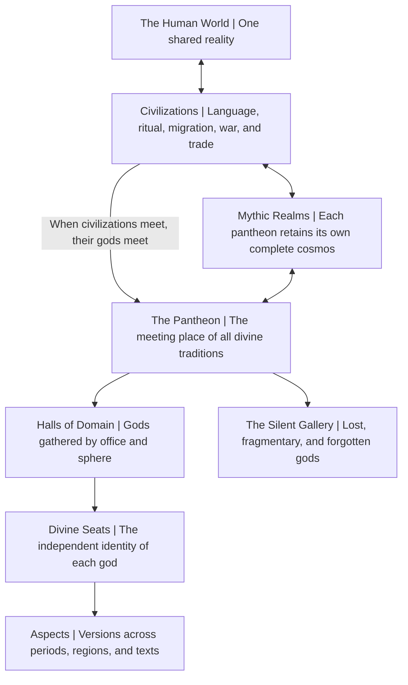

# God-Museum · The Pantheon

[](./LICENSE)

**English** · [中文](./README.md)

**Read online:** [chendahuang.com/god-museum](https://chendahuang.com/god-museum/)

> **One world. Many heavens. Ten thousand gods. One hall.**

There is only one human world, but there are many heavens.

Every civilization has seen the gods from its own direction and given them names in its own language. Olympus, the Nine Worlds, the Celestial Court, Kunlun, the Chinese underworld, Duat, and the Hindu heavens are each complete and true on their own terms. They do not need to be compressed onto one map or made to compete for the only correct universe.

When civilizations began to meet, their gods began to see one another. Their names, domains, stories, and forgotten seats eventually formed a Pantheon with no sole master and no final roster.

God-Museum does not declare that all gods are one god.

It simply lets all gods stand in the same hall for the first time.

---

## The founding purpose

We want to build a true Pantheon for the mythologies of East and West.

This is not another layout for a mythology encyclopedia, a power ranking, or an attempt to force the gods of different civilizations into one rewritten canon. Its purpose is to preserve myths that remain different by presenting them through a shared curatorial language.

The presentation is shared. The mythologies are not standardized.

Every god enters with a name, homeland, period, sources, domains, and contradictions intact. Gods with related domains may stand together. Gods with historical connections may meet again along the paths of cultural transmission. None of them must surrender their identity for the sake of comparison.

---

## The shape of the world



The setting rests on four statements:

- **One world:** Humanity inhabits one shared reality.
- **Many heavens:** Every civilization's mythic cosmos remains whole.
- **Ten thousand gods:** Similar domains do not make two gods identical.
- **One hall:** The gods may meet without consuming one another.

---

## One world · The shared human realm

The human world is the one place every pantheon truly shares.

Different civilizations faced the same sky, sun, sea, death, war, and disaster, yet built different mythic orders around them. Those orders are not competing answers to a standardized puzzle. They are different ways for civilizations to live with the world.

Trade, migration, war, intermarriage, translation, and religious transmission brought once-distant peoples into contact. They also caused the name of a god to be spoken in another language for the first time.

> Gods do not meet merely because their domains look alike. They meet because the people who worship, tell, and remember them meet.

Trade routes, ports, imperial frontiers, translation centers, pilgrimage roads, and diaspora communities are Civilizational Corridors shared by human history and the mythic realms. A god who crosses one may receive a new name, image, or interpretation without losing the place from which they came.

---

## Many heavens · Independent mythic realms

Every mythology retains its own structure of heaven and earth, its own shape of time, and its own order of life and death.

- Olympus operates according to Greek mythology.
- The Nine Worlds operate according to Norse mythology.
- The Celestial Court, Kunlun, and the underworld retain the layered origins and periods of Chinese tradition.
- The Egyptian gods inhabit an order shaped by the solar journey, kingship, and Duat.
- The Hindu heavens retain their own cosmic cycles, divine systems, and traditions of manifestation.

The Mythic Realms are not parallel countries or continents on a common geographic map. They are mythic layers attached to the human world and reached and narrated through different civilizations.

Zeus, Odin, the Jade Emperor, and Indra can therefore retain supreme authority within their respective systems. The Pantheon establishes no single king above all pantheons and measures no god from one tradition against another on a universal power scale.

---

## One hall · The Pantheon

The Pantheon belongs to no civilization and has no supreme ruler.

It is a meeting place, council, archive, sanctuary, and city of memory. It does not create gods, confer divinity, or decide who is more real. It preserves a place for every god once seriously feared, revered, narrated, and remembered by a civilization.

Its origin is contained in one sentence:

> The first door of the Pantheon appeared when humans first acknowledged that the god of another people was also a god.

Whenever one civilization truly encounters the god of another, a new road, chamber, or Divine Seat may appear. A road opens not because two gods happen to look alike, but because understanding, translation, transmission, conflict, or synthesis occurred in human history.

Rank within the Pantheon does not represent power. A god remains subject to the order of their home Mythic Realm. Entry into the Pantheon grants recognition by other pantheons, not authority over them.

---

## Ten thousand gods · How a god exists

The Pantheon preserves a god through five dimensions:

| Dimension | Meaning |
| --- | --- |
| **Divine Seat** | The god's independent identity within the Pantheon. Each god has one Seat. |
| **Domains** | The fields a god governs, influences, or embodies. A god may hold several. |
| **Aspects** | The god's forms across periods, regions, ritual traditions, and texts. |
| **Relations** | Explicitly typed connections to gods, heroes, civilizations, and mythic events. |
| **Sources** | The texts, inscriptions, rituals, images, and historical evidence that attest the god. |

### Divine Seat

A Divine Seat prevents a god from being erased by cross-cultural comparison.

Thor, Zeus, Leigong, and Indra all relate to thunder, but they possess different Seats. A shared domain may bring them into the same hall; it cannot prove that they are the same being.

### Domains

A domain is not merely a category label. It is the way a god acts upon the world.

Zeus concerns not only thunder, but also sky, kingship, order, oaths, and hospitality. Gods with an overlapping domain may play radically different cultural roles, so every comparison must preserve both likeness and difference.

### Aspects

The same god may appear in conflicting forms across texts, places, and periods.

The Pantheon selects no single canonical version. Early myth, local cult, organized religion, dynastic reinterpretation, and later literature may all become Aspects of one Seat, each labeled with its own source and period.

Contradiction is not an error. It is a layer left by a god's passage through history.

### Relations

Every relation within or across pantheons must state its nature:

- kinship, marriage, enmity, alliance, and subordination;
- alternate names for the same god;
- distinct Aspects of one god;
- transformations created through transmission;
- historically attested identification or syncretism;
- similar domains held by independent gods;
- original relationships created by God-Museum.

Resemblance, transmission, syncretism, and invention are not the same thing. Thor and Zeus are independent Seats with overlapping domains. Greek Zeus and Roman Jupiter have a more complex history of identification. Their relations must be recorded differently.

### Sources

Every Divine Seat leads back to the civilization that produced it.

Names, offices, kinship, stories, and images should be grounded wherever possible in specific texts, inscriptions, sites, artifacts, or ritual traditions. Later literature, modern popular culture, and God-Museum's original interpretations must be presented separately from earlier materials.

Sources establish how far a claim about a god can be confirmed. Original worldbuilding begins beyond that boundary.

---

## The Twelve Halls of Domain

The gods are gathered by domain rather than segregated by country.

1. **The Hall of Creation and Primordials:** chaos, cosmogony, creation, ancestors, and primordial beings.
2. **The Hall of Sky, Kingship, and Order:** heaven, divine sovereignty, law, oaths, and legitimate rule.
3. **The Hall of Sun, Moon, and Stars:** celestial bodies, light, calendars, day and night, and cosmic motion.
4. **The Hall of Thunder, Wind, Rain, and Fire:** weather, storms, lightning, flame, and divine punishment.
5. **The Hall of Mountains, Seas, and Rivers:** landscapes, oceans, springs, navigation, and natural borders.
6. **The Hall of Earth, Harvest, and Life:** agriculture, seasons, growth, healing, and the continuation of life.
7. **The Hall of Love, Marriage, and Birth:** desire, union, family, childbirth, and lineage.
8. **The Hall of War, Victory, and Guardianship:** battle, courage, protection of cities, vengeance, and triumph.
9. **The Hall of Wisdom, Craft, and Civilization:** knowledge, writing, making, music, medicine, and invention.
10. **The Hall of Fate, Prophecy, and Time:** destiny, divination, memory, time, and inescapable order.
11. **The Hall of Roads, Messengers, Trade, and Trickery:** travel, thresholds, language, commerce, theft, and transformation.
12. **The Hall of Death, Judgment, and the Underworld:** death, burial, souls, judgment, ancestors, and the afterlife.

A god may open into several Halls without being duplicated. The Halls are different ways of seeing a god; the Divine Seat is the god's complete identity.

The Twelve Halls are not an eternal and final taxonomy. When a god cannot fit the existing structure, the Pantheon must change its architecture rather than alter the god to suit the building.

---

## Around the Pantheon

Gods stand at the center, but no mythology is made of gods alone. Six connected regions surround the Pantheon.

### The Gallery of Heroes

It preserves demigods, culture heroes, sacred kings, warriors, prophets, godslayers, and mortals who entered divine realms. They are the most common agents between the human world and the Mythic Realms.

### The Treasury of Relics

It preserves divine weapons, crowns, contracts, instruments, vessels, and forbidden objects. Every relic must connect to its owner, maker, related events, and sources rather than becoming an isolated equipment list.

### The Court of Beasts

It preserves sacred animals, monsters, demons, spirits, and nonhuman beings that resist stable classification. They may be enemies, descendants, mounts, or manifestations of gods, or belong to an order older than the gods.

### The Theater of Myths

It preserves creation stories, divine wars, heroic journeys, floods, apocalypses, and changes of cosmic order. Versions of an event from different texts stand side by side. Similar events across civilizations may be compared but are not automatically declared to be the same historical occurrence.

### The Civilizational Corridors

They record how gods entered new cultures through trade routes, empires, migration, translation, and religious transmission. Historically attested borrowing, renaming, synthesis, and resistance form the real roads between the Mythic Realms.

### The Silent Gallery

It reserves places for gods who are lost, fragmentary, known only by name, or entirely forgotten.

A forgotten god does not immediately cease to exist. The god loses the road back into the human world, and the Divine Seat slowly recedes into darkness. If the name is rediscovered, translated, or spoken again, the sleeping Seat may relight.

The Pantheon preserves not only the most famous gods, but also empty places for conquered and silenced civilizations.

---

## How gods meet

Encounters between pantheons must follow intelligible paths.

### Cultural contact

Trade, migration, war, conquest, and intermarriage carry divine names into other languages. This is the most common and historically grounded path.

### Translation and identification

One civilization may understand a foreign god through one of its own. Such identification creates a relation in the Pantheon without automatically erasing the original difference between two Seats.

### Religious transmission

Gods, bodhisattvas, guardians, judges, and local deities may change gender, image, office, or kinship as they travel. Each transformation becomes a new Aspect and retains the path of transmission.

### Original convergence

God-Museum may let gods who never met in history speak, ally, or come into conflict within the Pantheon. These relations must be explicitly identified as setting canon. Creative freedom begins with clear provenance.

---

## Divine power, forgetting, and return

The Pantheon does not use a simple rule in which more believers automatically mean greater combat power.

- The number of worshippers does not determine whether a god exists.
- To act within the human world, a god needs an anchor: a name, symbol, story, ritual, or place.
- Forgetting does not destroy a god, but it closes the roads through which the god can affect the human world.
- Rediscovery, translation, and retelling may cause a sleeping Divine Seat to appear again.
- Authority within a home Mythic Realm cannot be converted directly into fighting strength within the Pantheon.

One foundational question remains permanently unanswered:

> Did humanity give names to the world and thereby create the gods, or did the gods first place their names into human language?

God-Museum gives no final answer on behalf of any civilization.

---

## Time, versions, and contradiction

Human time broadly moves forward. Mythic time may cycle, repeat, fracture, or hold different beginnings and endings in different texts.

The Pantheon stands outside those timelines. It can preserve the early, local, religious, and literary forms of a god at once without pretending that they were always identical.

Historical synthesis leaves new Aspects and relations. Historical rupture leaves absences. Contradictions that cannot be resolved are not quietly removed; they become part of the Divine Seat.

---

## Three layers of text

Every part of God-Museum must distinguish three layers:

### Source layer

What historical materials actually record: ancient texts, epics, inscriptions, archaeology, ritual, local tradition, and reliable scholarship.

### Curatorial layer

How God-Museum organizes pantheons, domains, versions, relations, and cross-cultural comparisons. Curatorial judgments must state their evidence and uncertainty.

### Setting layer

How God-Museum brings the gods into the Pantheon, portrays their encounters, and creates new stories between existing mythologies.

Sources do not certify invention, and invention does not impersonate ancient tradition. Keeping the layers distinct allows the Pantheon to respect mythology while building a world of its own.

---

## The boundaries of the Pantheon

God-Museum does not attempt to prove that gods physically exist, explain ancient mythology through modern science, or declare similar stories to be one historical event.

It establishes no single orthodoxy across civilizations, ranks no pantheon above another, substitutes no popular-culture image for primary tradition, and removes no contradiction merely to make the setting tidy.

Its purpose is to:

- preserve where every god came from;
- show how different civilizations understood related parts of the world;
- record how gods met, changed, and were forgotten through human history;
- create, on the foundation of clear provenance, a common hall capable of receiving them all.

The Pantheon has no final roster.

As long as humanity continues to recover lost names, reread old stories, and acknowledge that another civilization's god is also a god, the hall will continue to grow.

---

## Enter the Pantheon

The setting now operates as a real, connected content repository:

- [Full catalog](./CATALOG.md)
- [Constitution and cataloging protocols](./00_foundation/README.md)
- [The Twelve Halls of Domain](./01_halls/README.md)
- [Divine Seat records](./02_deities/README.md)
- [Civilizations, Mythic Realms, and Corridors](./03_civilizations/README.md)
- [Gallery of Heroes](./04_heroes/README.md)
- [Treasury of Relics](./05_relics/README.md)
- [Court of Beings](./06_beasts/README.md)
- [Mythic Realms and Places](./07_places/README.md)
- [Theater of Myths](./08_myths/README.md)
- [Chronicles of the Pantheon](./10_chronicles/README.md)
- [Bibliography and source nodes](./99_sources/bibliography.md)

Fifty-eight formal Divine Seats now exist. Beyond Di/Shangdi, Tian/Haotian, Houtu, Sheji, Hebo, and Taiyi, the Chinese collection now establishes historically situated records for Taishang Laojun, Yuanshi Tianzun, Lingbao Tianzun, the Jade Emperor, and the Three Officials while keeping Di Jun as an important but fragmentary genealogical node. The Ugaritic collection continues to connect El, Athirat, Baal-Haddu, Anat, Yam, Mot, Shapshu, Kothar-wa-Khasis, Athtart, and Yarikh through a Bronze Age Northwest Semitic archive. Seven fragmentary names or groups remain in the Silent Gallery rather than being completed through modern invention.

The archive now contains seventy-three formal Divine Seats, with seven fragmentary names or groups preserved in the Silent Gallery. Greek, Norse, and Vedic collections have each grown into seven-seat networks organized around succession and local cult, knowledge and the approaching end, and hymn, sacrifice, cosmic order, and the roads of the dead.

The seats now form a connected collection rather than isolated biographies. Nineteen heroes or royal actors, twenty relics and textual artifacts, seventeen nonhuman beings, thirty-three mythic or historical places, forty-one sourced mythic or religious events, and three explicitly original Chronicles connect gods, people, artifacts, cities, temples, corridors, and Halls into one searchable archive.

The Chinese collection is organized through historically situated aspects rather than an undated celestial bureaucracy. Its early textual layers remain separate, while the new Daoist layer proceeds from the *Sanguozhi* accounts of Huming Mountain, the Three Officials' petitions, and the Zhang lineage into the *Xiang'er* commentary, Six Dynasties Lingbao scriptures, the *Zhenling Weiye Tu*, the formation of the Three Pure Ones, and the Song state's elevation of the Jade Emperor. Celestial Masters, the Three Pure Ones, and the Jade Emperor enter through different scriptures, rituals, and institutions rather than overwrite Di, Tian, Taiyi, or other earlier sacred orders.

The Shang-through-Han state-ritual layer now separates Di in late Shang oracle records from Zhou Tian and Huangtian Shangdi, documents the transferability of the Mandate through the *Shao Gao*, *Duo Shi*, and “Wen Wang,” and reconstructs Houtu, Houji, She, and Ji through the *Guoyu* and *Liji*. Actual oracle bones and a Shang bronze ding provide material anchors. Taiyi, Houtu, Mount Tai, the Mingtang, and Fengshan show the Han empire actively reorganizing sacred authority rather than passively inheriting an unchanged ancient pantheon.

The Daoist sacred-bureaucracy layer separates Lord Lao as an early Celestial Master revealer, Yuanshi Tianzun as the high revealer of Lingbao cosmic cycles, the Three Pure Ones as a Six Dynasties-through-Song integration of scriptures and images, and the Jade Emperor as an administrative sovereign elevated through Song titles and state ritual. Zhang Daoling, Mount Heming, the fragmentary *Xiang'er* manuscript, the Three Officials' petitions, and the *Zhenling Weiye Tu* provide human, geographic, material, and cataloging anchors for a celestial order that can be historically traced rather than assumed.

The Egyptian collection preserves three structures that cannot be flattened: the continuity and variation among Pyramid Texts, Coffin Texts, the Book of the Dead, and Netherworld Books; the changing religious map of local cities and temples; and the difference between the fission of Horus aspects and historical syncretism such as Amun-Ra. The Hall of Thunder, Wind, Rain, and Fire remains the first cross-cultural hall completed in depth, while the Halls of celestial bodies, love and birth, and death and judgment now hold fully sourced collections rather than placeholders.

The Mesopotamian collection preserves the linguistic and political seams among Sumerian, Akkadian, Babylonian, and Assyrian materials. Bilingual deity names do not turn translation into automatic identity. The Sumerian and Akkadian descent narratives stand side by side; the Ziusudra, Atrahasis, and Uta-napišti flood traditions remain distinct; and no modern dragon image is allowed to masquerade as a securely identified ancient portrait of Tiamat. Nippur, Eridu, Uruk, Babylon, and Borsippa make cities and temples part of the archive's structure.

The Ugaritic collection is organized around the archaeological context of Ras Shamra and explicit KTU text numbers rather than an undated, standardized “Canaanite pantheon.” El's council authority coexists with Baal's active kingship. Yam and Mot retain divine identities after defeat. The broken endings of Kirta and Aqhat are not completed by modern invention. Mount Saphon, maritime trade, Hurrian divine names, Egyptian artifacts, and later Phoenician or Hebrew materials form historically labeled corridors rather than automatic identities.

The archive documents are currently Chinese-first. Stable IDs and links are language-neutral so that translations can be added without changing the canon.

---

## Website and repository

GitHub Markdown is the single content source for God-Museum. The website maintains no duplicate body copy and uses no CMS. Astro reads these documents at build time to generate the home page, full catalog, deity and hall pages, and local full-text search.

```bash
pnpm install
pnpm dev               # http://localhost:43118/god-museum/
pnpm build             # catalog validation + types + static build + internal-link verification
pnpm deploy            # deploy the independent Cloudflare Pages project
pnpm deploy:router     # deploy the chendahuang.com/god-museum/* path proxy
```

Deployment topology:

- Independent Pages project: `god-museum.pages.dev`
- Public canonical address: `https://chendahuang.com/god-museum/`
- The Worker handles only `/god-museum` and `/god-museum/*`; all other blog paths remain untouched.
- Astro writes to `dist/god-museum`, while Pages receives `dist` so the public path prefix is preserved.

---

## License

The God-Museum setting, text, taxonomy, cosmology, pantheon curation, and related original expression are not openly licensed. You may read, fork, open issues, and submit pull requests for discussion. Without prior written permission, you may not copy, adapt, redistribute, commercialize, or use the material in games, fiction, comics, films, exhibitions, datasets, model training, or other derivative projects.

See [LICENSE](./LICENSE) for the full terms. Contact the project owner before collaboration or commercial use.
