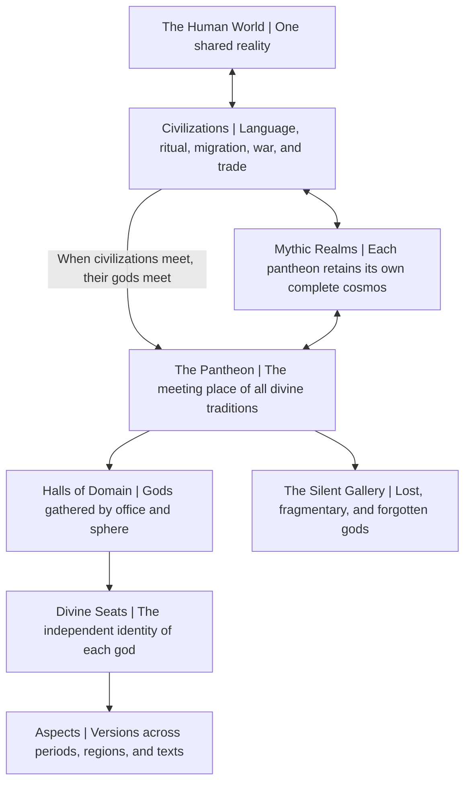

# God-Museum · The Pantheon

[](./LICENSE)

**English** · [中文](./README.md)

**Read online:** [chendahuang.com/god-museum](https://chendahuang.com/god-museum/)

> **One world. Many heavens. Ten thousand gods. One hall.**

You are opening a building that belongs to no civilization.

There is only one human world, but there are many heavens. The Greeks looked up and saw Olympus. The Norse saw the Nine Worlds. Shang and Zhou priests wrote down Di. Daoist masters sketched the Three Pure Ones. Egyptians sailed through Duat, and the people of Mesopotamia raised cities for their gods. Each heaven runs complete, owing nothing to the others, and none of them needs to be squeezed onto a single map.

When civilizations met, these heavens began to see one another. Names, domains, stories, and forgotten seats slowly gathered into a Pantheon with no owner and no final roster.

There is only one thing left for you to do: walk in.

---

## What this is

We set out to build a true Pantheon for the mythologies of East and West.

This is not another layout for a mythology encyclopedia, not a power ranking, and not an attempt to rewrite the gods of different civilizations into a single canon. It is a shared curatorial language, used to preserve mythologies that remain different.

The presentation is shared. The mythologies are not.

Every god enters with a name, a homeland, a period, sources, domains, and contradictions intact. Gods with related domains may stand together. Gods with historical connections may meet again along the roads of cultural transmission. But no god loses an identity for the convenience of comparison.

---

## The shape of the world


```mermaid
flowchart TB
    E["The Human World | One shared reality"]
    C["Civilizations | Language, ritual, migration, war, and trade"]
    R["Mythic Realms | Each pantheon retains its own complete cosmos"]
    P["The Pantheon | The meeting place of all divine traditions"]
    H["Halls of Domain | Gods gathered by office and sphere"]
    G["Divine Seats | The independent identity of each god"]
    F["Aspects | Versions across periods, regions, and texts"]
    S["The Silent Gallery | Lost, fragmentary, and forgotten gods"]

    E <--> C
    C <--> R
    C -->|"When civilizations meet, their gods meet"| P
    R <--> P
    P --> H
    H --> G
    G --> F
    P --> S
```

The whole building rests on four foundation stones:

- **One world:** humanity lives in one shared reality.
- **Many heavens:** each civilization's mythic cosmos stays whole.
- **Ten thousand gods:** shared domains do not make two gods the same.
- **One hall:** the gods may meet without consuming one another.

---

## One world · The shared human realm

The only thing every pantheon truly shares is this one world.

The same sky, the same sun, the same life and death stood before every civilization. Each built its own mythic order out of the same reality. Between those orders there is no standard answer — only each civilization's way of living with the world.

Trade, migration, war, intermarriage, translation, and religious transmission brought strangers into contact and carried the name of a god into another language for the first time.

> Gods do not meet merely because their domains look alike. They meet because the people who worship, tell, and remember them meet.

Trade routes, ports, imperial frontiers, translation centers, pilgrimage roads, and diaspora communities are the corridors that history and the mythic realms walked together. A god who crosses one may gain a new name, image, or reading — without losing where he came from.

---

## Many heavens · Independent mythic realms

Every mythology keeps its own structure of heaven and earth, its own shape of time, and its own order of life and death.

- Olympus runs on Greek mythology.
- The Nine Worlds run on Norse mythology.
- The Celestial Court, Kunlun, and the underworld keep the layered origins and periods of Chinese tradition.
- The Egyptian gods live in an order built from the solar journey, kingship, and Duat.
- The Hindu heavens keep their own cosmic cycles, pantheons, and traditions of manifestation.

The Mythic Realms are not parallel nations, nor continents drawn on one map. They are mythic layers attached to the human world, reached and narrated by different civilizations.

So Zeus, Odin, the Jade Emperor, and Indra may each hold supreme authority within their own system. The Pantheon appoints no single high king above all pantheons and measures no god from one tradition against another on a universal power scale.

---

## One hall · The Pantheon

The Pantheon belongs to no civilization and has no supreme ruler.

It is a meeting place, a council, an archive, a sanctuary, and a city of memory. It does not create gods, grant divinity, or decide who is more real. It keeps a place for every god once seriously feared, revered, narrated, and remembered by a civilization.

Its origin is one sentence:

> The first door of the Pantheon appeared when humans first acknowledged that the god of another people was also a god.

Each time one civilization truly comes to know another civilization's god, a new road, chamber, or Divine Seat may appear in the hall. A road opens not because two gods happen to look alike, but because understanding, translation, transmission, conflict, or synthesis really happened in human history.

Rank inside the hall does not mean power. A god remains subject to the order of his home Mythic Realm; entering the Pantheon grants the right to be seen by other pantheons, not the right to rule them.

---

## Ten thousand gods · How a god exists

The Pantheon preserves a god through five dimensions:

| Dimension | Meaning |
| --- | --- |
| **Divine Seat** | The god's independent identity within the Pantheon. Each god has one Seat. |
| **Domains** | The fields a god governs, influences, or embodies. A god may hold several. |
| **Aspects** | The god's forms across periods, regions, ritual traditions, and texts. |
| **Relations** | Explicitly typed connections to gods, heroes, civilizations, and mythic events. |
| **Sources** | The texts, inscriptions, rituals, images, and historical evidence that attest the god. |

### Divine Seat

A Divine Seat prevents a god from being erased by cross-cultural comparison.

Thor, Zeus, Leigong, and Indra all relate to thunder, but they hold different Seats. A shared domain may bring them into the same hall; it cannot prove they are the same being.

### Domains

A domain is not a label. It is the way a god acts upon the world.

Zeus concerns not only thunder, but also sky, kingship, order, oaths, and hospitality. Two gods may share a domain yet play radically different cultural roles — so every comparison must lay out likeness and difference together.

### Aspects

The same god may appear in conflicting forms across texts, places, and periods.

The Pantheon does not pick a "true" version for you. Early myth, local cult, organized religion, dynastic reinterpretation, and later literature may all become Aspects of one Seat, each labeled with its own source and period.

Contradiction is not an error. It is a stratum the god left in history.

### Relations

Every relation within or across pantheons must state its nature:

- kinship, marriage, enmity, alliance, and subordination;
- alternate names for the same god;
- distinct Aspects of one god;
- transformations created through transmission;
- historically attested identification or syncretism;
- similar domains held by independent gods;
- original relationships created by God-Museum.

Resemblance, transmission, syncretism, and invention are not the same thing. Thor and Zeus are independent Seats with overlapping domains. Greek Zeus and Roman Jupiter have a more complex history of identification. Their relations must be recorded differently.

### Sources

Every Divine Seat leads back to the civilization that produced it.

Names, offices, kinship, stories, and images should be grounded wherever possible in specific texts, inscriptions, sites, artifacts, or ritual traditions. Later literature, modern popular culture, and God-Museum's original interpretations must be kept apart from the earlier materials.

Sources decide how far a claim about a god can be confirmed. Original worldbuilding begins beyond that boundary.

---

## The Twelve Halls of Domain

The gods enter by domain, not by nationality.

1. **The Hall of Creation and Primordials:** chaos, cosmogony, creation, ancestors, and primordial beings.
2. **The Hall of Sky, Kingship, and Order:** heaven, divine sovereignty, law, oaths, and legitimate rule.
3. **The Hall of Sun, Moon, and Stars:** celestial bodies, light, calendars, day and night, and cosmic motion.
4. **The Hall of Thunder, Wind, Rain, and Fire:** weather, storms, lightning, flame, and divine punishment.
5. **The Hall of Mountains, Seas, and Rivers:** landscapes, oceans, springs, navigation, and natural borders.
6. **The Hall of Earth, Harvest, and Life:** agriculture, seasons, growth, healing, and the continuation of life.
7. **The Hall of Love, Marriage, and Birth:** desire, union, family, childbirth, and lineage.
8. **The Hall of War, Victory, and Guardianship:** battle, courage, protection of cities, vengeance, and triumph.
9. **The Hall of Wisdom, Craft, and Civilization:** knowledge, writing, making, music, medicine, and invention.
10. **The Hall of Fate, Prophecy, and Time:** destiny, divination, memory, time, and inescapable order.
11. **The Hall of Roads, Messengers, Trade, and Trickery:** travel, thresholds, language, commerce, theft, and transformation.
12. **The Hall of Death, Judgment, and the Underworld:** death, burial, souls, judgment, ancestors, and the afterlife.

A god may open into several Halls without splitting into multiple identities. The Halls are different doors for seeing a god; the Divine Seat is the god's whole existence.

The Twelve Halls are not an eternal and final taxonomy. When a god will not fit the structure, the Pantheon changes its architecture for the god — it does not rewrite the god to fit the building.

---

## Around the Pantheon

Gods stand at the center, but no mythology is made of gods alone. Leave the main hall and you will pass six connected regions.

### The Gallery of Heroes

Demigods, culture heroes, sacred kings, warriors, prophets, godslayers, and mortals who entered divine realms. They are the most common agents between the human world and the Mythic Realms.

### The Treasury of Relics

Divine weapons, crowns, contracts, instruments, vessels, and forbidden objects. Every relic must connect to its owner, maker, related events, and sources — not exist as an equipment list cut off from mythology.

### The Court of Beasts

Sacred animals, monsters, demons, spirits, and nonhuman beings that resist stable classification. They may be enemies, descendants, mounts, or manifestations of gods, or belong to an order older than the gods.

### The Theater of Myths

Creation stories, divine wars, heroic journeys, floods, apocalypses, and changes of cosmic order. Versions of an event from different texts stand side by side. Similar events across civilizations may be compared, but they are not automatically declared the same historical occurrence.

### The Civilizational Corridors

How gods entered new cultures through trade routes, empires, migration, translation, and religious transmission. Historically attested borrowing, renaming, synthesis, and resistance form the real roads between the Mythic Realms.

### The Silent Gallery

Places reserved for gods who are lost, fragmentary, known only by name, or entirely forgotten.

A forgotten god does not vanish at once. He loses the road back into the human world, and his Divine Seat slowly recedes into darkness. If the name is rediscovered, translated, or spoken again, the sleeping Seat may relight.

The Pantheon keeps not only its most famous gods, but also empty places for conquered and silenced civilizations.

---

## How gods meet

Encounters between pantheons must follow intelligible paths.

### Cultural contact

Trade, migration, war, conquest, and intermarriage carry divine names into other languages. This is the most common and the most historically grounded path.

### Translation and identification

One civilization may understand a foreign god through one of its own. The Pantheon records the relation — without silently erasing the original difference between the two Seats.

### Religious transmission

Gods, bodhisattvas, guardians, judges, and local deities may change gender, image, office, or kinship as they travel. Each transformation becomes a new Aspect and retains the path of transmission.

### Original convergence

God-Museum may let gods who never met in history speak, ally, or come into conflict inside the Pantheon, but such relations must be explicitly marked as setting canon. Creative freedom begins with clear provenance.

---

## Divine power, forgetting, and return

The Pantheon does not use the simple rule that more believers mean greater combat power.

- The number of worshippers does not determine whether a god exists.
- To act within the human world, a god needs an anchor: a name, symbol, story, ritual, or place.
- Forgetting does not destroy a god, but it closes the roads through which he can affect the human world.
- Rediscovery, translation, and retelling may cause a sleeping Divine Seat to appear again.
- Authority within a home Mythic Realm cannot be converted directly into fighting strength inside the Pantheon.

One foundational question remains permanently unanswered:

> Did humanity give names to the world and thereby create the gods, or did the gods first place their names into human language?

God-Museum gives no final answer on behalf of any civilization.

---

## Time, versions, and contradiction

Human time broadly moves forward. Mythic time may cycle, repeat, fracture, or hold different beginnings and endings in different texts.

The Pantheon stands outside those timelines. It can preserve the early, local, religious, and literary forms of a god at once without pretending they were always identical.

Historical synthesis leaves new Aspects and relations. Historical rupture leaves absences. Contradictions that cannot be resolved are not quietly removed; they become part of the Divine Seat.

---

## Three layers of text

Every part of God-Museum must distinguish three layers:

### Source layer

What historical materials actually record: ancient texts, epics, inscriptions, archaeology, ritual, local tradition, and reliable scholarship.

### Curatorial layer

How God-Museum organizes pantheons, domains, versions, relations, and cross-cultural comparisons. Curatorial judgments must state their evidence and uncertainty.

### Setting layer

How God-Museum brings the gods into the Pantheon, portrays their encounters, and creates new stories between existing mythologies.

Sources do not certify invention, and invention does not impersonate ancient tradition. With the layers kept apart, the Pantheon can respect mythology and still build a world of its own.

---

## The boundaries of the Pantheon

God-Museum does not attempt to prove that gods physically exist, explain ancient mythology through modern science, or declare similar stories to be one historical event.

It establishes no single orthodoxy across civilizations, ranks no pantheon above another, substitutes no popular-culture image for primary tradition, and removes no contradiction merely to make the setting tidy.

It does only four things:

- preserve where every god came from;
- show how different civilizations understood related parts of the world;
- record how gods met, changed, and were forgotten through human history;
- create, on the foundation of clear provenance, a common hall that can actually hold them all.

The Pantheon has no final roster.

As long as humanity keeps recovering lost names, rereading old stories, and acknowledging that another civilization's god is also a god, the hall will keep growing.

---

## Enter the Pantheon

The hall is open. Here is the way in from the front gate:

- [Full catalog](./CATALOG.md)
- [Constitution and cataloging protocols](./00_foundation/README.md)
- [The Twelve Halls of Domain](./01_halls/README.md)
- [Divine Seat records](./02_deities/README.md)
- [Civilizations, Mythic Realms, and Corridors](./03_civilizations/README.md)
- [Gallery of Heroes](./04_heroes/README.md)
- [Treasury of Relics](./05_relics/README.md)
- [Court of Beings](./06_beasts/README.md)
- [Mythic Realms and Places](./07_places/README.md)
- [Theater of Myths](./08_myths/README.md)
- [Chronicles of the Pantheon](./10_chronicles/README.md)
- [Bibliography and source nodes](./99_sources/bibliography.md)

Ninety-eight formal Divine Seats now exist, with seven fragmentary names or groups preserved in the Silent Gallery. The Greek collection has grown into a fourteen-seat network, the Vedic into a twelve-seat network, the Norse collection now holds fifteen seats, and the Egyptian collection into a thirteen-seat network — organized around succession and local cult, wine and mystery cult; hymn, sacrifice, cosmic order, and the roads of the dead; knowledge, constraint, exchange, and Ragnarök; and the solar journey, kingship, multiple creation metaphors, and the judgment of the dead. They are no longer mere samples standing in for Zeus/Athena, Odin/Thor, or Indra/Agni.

The seats form a connected collection rather than isolated biographies. Nineteen heroes or royal actors, twenty relics and textual artifacts, seventeen nonhuman beings, thirty-three mythic or historical places, forty-one sourced mythic or religious events, and three explicitly original Chronicles connect gods, people, artifacts, cities, temples, corridors, and Halls into one searchable archive.

The Chinese collection is organized through historically situated Aspects rather than an undated celestial bureaucracy. Its early textual layers remain separate, while the new Daoist layer proceeds from the *Sanguozhi* accounts of Huming Mountain, the Three Officials' petitions, and the Zhang lineage into the *Xiang'er* commentary, Six Dynasties Lingbao scriptures, the *Zhenling Weiye Tu*, the formation of the Three Pure Ones, and the Song state's elevation of the Jade Emperor. Celestial Masters, the Three Pure Ones, and the Jade Emperor enter through different scriptures, rituals, and institutions rather than overwrite Di, Tian, Taiyi, or other earlier sacred orders.

The Shang-through-Han state-ritual layer separates Di in late Shang oracle records from Zhou Tian and Huangtian Shangdi, documents the transferability of the Mandate through the *Shao Gao*, *Duo Shi*, and "Wen Wang," and reconstructs Houtu, Houji, She, and Ji through the *Guoyu* and *Liji*. Actual oracle bones and a Shang bronze ding provide material anchors. Taiyi, Houtu, Mount Tai, the Mingtang, and Fengshan show the Han empire actively reorganizing sacred authority rather than passively inheriting an unchanged ancient pantheon.

The Daoist sacred-bureaucracy layer separates Lord Lao as an early Celestial Master revealer, Yuanshi Tianzun as the high revealer of Lingbao cosmic cycles, the Three Pure Ones as a Six Dynasties-through-Song integration of scriptures and images, and the Jade Emperor as an administrative sovereign elevated through Song titles and state ritual. Zhang Daoling, Mount Heming, the fragmentary *Xiang'er* manuscript, the Three Officials' petitions, and the *Zhenling Weiye Tu* provide human, geographic, material, and cataloging anchors for a celestial order that can be historically traced rather than assumed.

The Egyptian collection preserves three structures that cannot be flattened: the continuity and variation among Pyramid Texts, Coffin Texts, the Book of the Dead, and Netherworld Books; the changing religious map of local cities and temples; and the difference between the fission of Horus Aspects and historical syncretism such as Amun-Ra. The Hall of Thunder, Wind, Rain, and Fire remains the first cross-cultural hall completed in depth, while the Halls of sun, moon, and stars, of love and birth, and of death and judgment now hold fully sourced collections rather than placeholders.

The Mesopotamian collection preserves the linguistic and political seams among Sumerian, Akkadian, Babylonian, and Assyrian materials. Bilingual deity names do not turn translation into automatic identity. The Sumerian and Akkadian descent narratives stand side by side; the Ziusudra, Atrahasis, and Uta-napišti flood traditions remain distinct; and no modern dragon image is allowed to masquerade as a securely identified ancient portrait of Tiamat. Nippur, Eridu, Uruk, Babylon, and Borsippa make cities and temples part of the archive's structure.

The Ugaritic collection is organized around the archaeological context of Ras Shamra and explicit KTU text numbers rather than an undated, standardized "Canaanite pantheon." El's council authority coexists with Baal's active kingship. Yam and Mot retain divine identities after defeat. The broken endings of Kirta and Aqhat are not completed by modern invention. Mount Saphon, maritime trade, Hurrian divine names, Egyptian artifacts, and later Phoenician or Hebrew materials form historically labeled corridors rather than automatic identities.

These entries link through holding, enmity, participation in events, place of origin, and motif comparison. A reader can walk from one god to his relic, into the related myths and rivals, and back out to the civilizational traditions and cross-cultural Halls. The GitHub Markdown and the website's full-text search read the same collection network.

The archive documents are currently Chinese-first. Stable IDs and links are language-neutral so that translations can be added without changing the canon.

---

## Website and repository

GitHub Markdown is the single content source for God-Museum. The website maintains no duplicate body copy and uses no CMS. Astro reads these documents at build time to generate the home page, full catalog, deity and hall pages, and local full-text search.

```bash
pnpm install
pnpm dev               # http://localhost:43118/god-museum/
pnpm build             # catalog validation + types + static build + internal-link verification
pnpm deploy            # deploy the independent Cloudflare Pages project
pnpm deploy:router     # deploy the chendahuang.com/god-museum/* path proxy
```

Deployment topology:

- Independent Pages project: `god-museum.pages.dev`
- Public canonical address: `https://chendahuang.com/god-museum/`
- The Worker handles only `/god-museum` and `/god-museum/*`; all other blog paths remain untouched.
- Astro writes to `dist/god-museum`, while Pages receives `dist` so the public path prefix is preserved.

---

## License

The God-Museum setting, text, taxonomy, cosmology, pantheon curation, and related original expression are not openly licensed. You may read, fork, open issues, and submit pull requests for discussion. Without prior written permission, you may not copy, adapt, redistribute, commercialize, or use the material in games, fiction, comics, films, exhibitions, datasets, model training, or other derivative projects.

See [LICENSE](./LICENSE) for the full terms. Contact the project owner before collaboration or commercial use.
